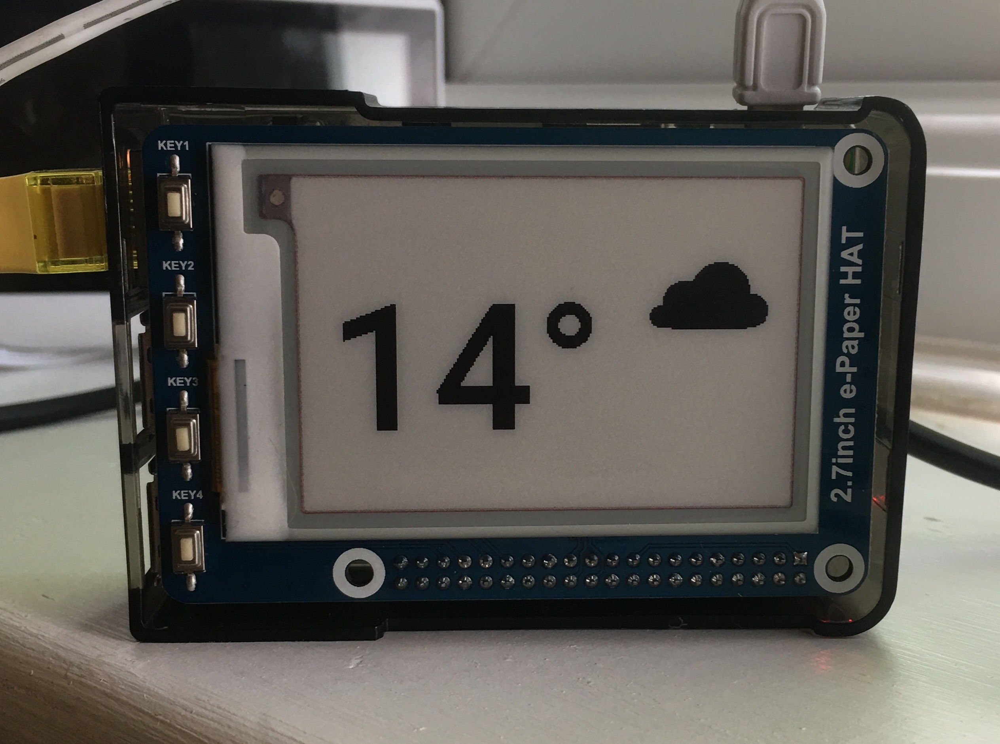

# Weather Display

A simple app for running a weather display on a raspberry pi with an e-ink
display. It's currently configured to show three different displays:
temperature -> sunset time -> temperature -> pollen count.



# Installing

Create a new virtual environments (or don't, I wont tell). Something like:

```bash
mkvirtualenv --python=python3 weather-display
```

Then install the dependencies:

```bash
pip install -r requirements.txt
```

And that's it!

# Usage

There are two scripts to run:

```bash
python run_api.py
```

and

```bash
python run_ui.py
```

as well as some env variables to set. I have a `.env` file that looks a little
something like:

```bash
OPEN_WEATHER_API_KEY="<your-open-weather-api-key>"
OPEN_WEATHER_CITY_ID="<your-open-weather-city-id>"
OPEN_WEATHER_SAVE_PATH="./open-weather.json"  # where the api results are saved

BBC_WEATHER_SAVE_PATH="./bbc.txt"  # where the api results are saved

API_UPDATE_INTERVAL=300  # how often to query the apis (every 5 mins)

UI_IMAGE_PATH="./ui.png"  # where the ui image is saved

UI_UPDATE_INTERVAL=60  # how often the ui is updated (every min)
```

And that's all. Enjoy!
